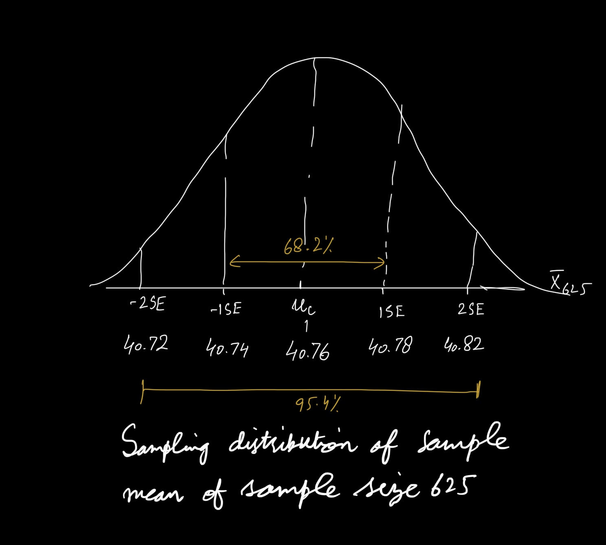

Millions of low-income Americans live in high-poverty neighborhoods, which also tend to be racially segregated and sometimes have issues with community violence. While social scientists have long believed a lack of investment in these neighborhoods contributes to negative outcomes for the residents living in them, it is often difficult to establish a causal link between neighborhood conditions and individual outcomes. The Moving to Opportunity (MTO) demonstration was designed to test whether offering housing vouchers to families living in public housing in high-poverty neighborhoods could lead to better experiences and outcomes by providing financial assistance to move to lower-poverty neighborhoods.

Between 1994 and 1998 the U.S. Department of Housing and Urban Development enrolled 4,604 low-income households from public housing projects in Baltimore, Boston, Chicago, Los Angeles, and New York in MTO, *randomly assigning* enrolled families in each site to one of three groups: (1) The low-poverty voucher group received special MTO vouchers, which could only be used in census tracts with 1990 poverty rates below 10% and counseling to assist with relocation; (2) the traditional voucher group received regular section 8 vouchers, which they could use anywhere; and (3) the control group, who received no vouchers but continued to qualify for any project-based housing assistance they were entitled to receive. Today we will use the MTO data to investigate properties of confidence intervals. This exercise is based on the following article and the data is a subset of the data used for this article:

Ludwig, J., Duncan, G.J., Gennetian, L.A., Katz, L.F., Kessler, J.R.K., and Sanbonmatsu, L., 2012. "[Neighborhood Effects on the Long-Term Well-Being of Low-Income Adults](https://dx.doi.org/10.1126/science.1224648)." *Science*, Vol. 337, Issue 6101, pp. 1505-1510.

The file `mto2.csv` includes the following variables for 3,263 adult participants in the voucher and control groups:

 Name                             |Description
 -------------------------------- |----------------------------------------------------
 `group`                          | factor with 3 levels: `lpv` (low-poverty voucher), `sec8` (traditional section 8 voucher), and `control` 

 `econ_ss_zcore`                  | Standardized measure of economic self-sufficiency, centered around the control group mean and re-scaled such that the control group mean = 0 and its standard deviation = 1. Measure aggregates several measures of economic self-sufficiency or dependency (earnings, government transfers, employment, etc.)

 `crime_vic`                      | Binary variable, `1` if a member of that household was the victim of a crime  in the six months prior to being assigned to the MTO program, `0` otherwise based on self-report


The data we will use are not the original data as this dataset has been modified to protect participants' confidentiality, but the results of our analysis will be consistent with published data on the MTO demonstration. 

```{r}
mto2 <- read.csv("data/mto2.csv")
library(tidyverse)

```

## Question 1 [6 pts]

One of the baseline covariates in this dataset is crime victimization. We are going to use this variable (`crime_vic`) to learn about the coverage of confidence intervals created using information from a single sample. We will consider this dataset to be a complete population so we have the measurements of interest `crime_vic` for the entire population. Our parameter of interest is the proportion of households in this population where a household member experienced crime victimization in the last 6 months, $\mu_C$.   

How large is this population?  Calculate $\mu_C$, the proportion of households where a household member experienced crime victimization in the last 6 months in the population.  Calculate the population level standard deviation of the `crime_vic` variable, $\sigma_C$.  Is the `crime_vic`  variable discrete or continuous? If discrete what kind of discrete variable is it? Make a histogram of the `crime_vic` variable in the population.


## Answer 1
```{r}
pop_mean <- mean(mto2$crime_vic)
pop_mean
pop_sd <- sd(mto2$crime_vic)
pop_sd
hist(mto2$crime_vic)
```
In this population of 3,263 low income households (population size), the proportion of households where a household member experienced crime victimization in the last 6 months is 40.76%. The population level standard deviation of crime victimization variable is 0.50. 
The population size is 3,263. The *crime_vic* variable is discrete variable and within discrete variable types, it is a dichotomous variable.
Since the *crime_vic* is dichotomous so histogram gives us only two bars and the heights of these correspond to the frequency of people falling in each of these i.e. who experienced or did not experience crime victimization, it is bi-model as there are only two groups. 

\newpage
## Question 2 [11 pts]

### 2a [7 points]

Consider samples of size n = 625 from this population. What summary statistic would we use from each of these samples to estimate the parameter of interest? Does the central limit theorem apply? Why does it or does it not apply? If it does apply, what are the implications of the CLT for what the sampling distribution of this summary statistic will be over repeated sampling (what are the mean, standard deviation, and shape of the sampling distribution)? 

### 2b [4 points]

By hand, sketch the sampling distribution of this summary statistic and label the horizontal axis with regularly-spaced numbers and a label in words. From problem 1 we have the population standard deviation of the crime victimization variable, $\sigma_C$, and you know the sample size - use these to calculate the exact standard error. In your figure, also indicate the locations one and two standard errors away from the population parameter.

You can paste a sketch by taking a picture, converting it into a pdf, and paste it in with the rest of your Rmarkdown answers - see the R Guide for guidance on how to do this.

## Answer 2

### Answer 2a
We will use the mean of binary variable *crime_vic* in these samples of sample size of 625 to estimate the population mean of adults who experienced victimization during last 6 months. The central limit theorem applies here as we are dealing with a repeated sample of size 625 and the mean of this repeated sampling distribution is equal to the population mean and the standard deviation [standard error] of the sampling distribution is equal to *pop_sd/sqrt(625)* which is 0.02 percentage points. Also the sample size of 625 is reasonably large and given the binary variable of *crime_vic* there is no skew expected in the distribution because there are only two groups here and the shape of samping distribution under repeated sampling will follow a normal distribution. 

```{r}
# calculating true mean
true_se = pop_sd/sqrt(625)
true_se
```

### Answer 2b
The standard error of all possible sample means for samples of size n = 625 is 0.02 percentage points.  This is how far we expect the sample means to be from the population mean.
\newpage


## Question 3 [17 pts]


### 3a [3 points]
Consider 90% confidence intervals for the population parameter of interest. What is the formula for the 90% CI when the CLT applies?

### 3b [9 points]

For any single sample, we obtain a single summary statistic value that we use to estimate the parameter of interest. Using the single sample summary statistic, the exact standard error from Question 2, and the formula for the 90% CI we can create a single CI. We will repeat this process 20 times.

The code that follows below will draw the samples, calculate and record the summary statistic for each sample and calculate and record the 90% confidence interval for each sample (by calculating and recording the lower confidence limit and upper confidence limit).  You need to fill in the number of samples, the sample size, the data set for the whole population, the variable name, the type of confidence interval (here use 'normal'), and set the seed value to a value that only you use.

Create a histogram of the 20 sample means. Using the true standard error of the sampling distribution of the sample summary statistics that you calculated in Question 2 determine how many of your 20 sample means are within 1 standard error of the population proportion who experienced crime victimization, how many are within 2 standard errors, and how many are within 3 standard errors.  

### 3c [5 points]

Create a figure showing the value of the parameter of interest and the 20 confidence intervals created by the 20 samples (using R or by sketch by hand). How many of these 20 90% confidence intervals do we expect to contain the population parameter? How many of your 20 confidence intervals contain the population parameter? If any of your confidence intervals did not contain the population parameter value, how far (in standard errors) were those samples' summary statistics from the population parameter value?


## Answer 3

```{r}
SimulateSamplingDistribution2 <- function(population_data, 
                                          number_samples, 
                                          sample_size, 
                                          variable_name, 
                                          distribution_type, # can be "t" or "normal"
                                          seed = 10) {
        set.seed(seed)
        
        true_se = sd(unlist(population_data[variable_name]))/sqrt(sample_size)
        
        if (distribution_type == 'normal') {q = qnorm(0.95)}
        else if (distribution_type == 't'){q = qt(0.95, sample_size)}
        else {stop("distribution_type must be 't' or 'normal'.")}
        
        repsamp.df <- data.frame(trial = 1:number_samples,
                             samp.mean = rep(0, number_samples),
                             samp.sd = rep(0, number_samples),
                             samp.lowci = rep(0, number_samples),
                             samp.highci = rep(0, number_samples))
        
        for (i in 1:number_samples){
                sample.rows <- sample(1:nrow(population_data), 
                                      sample_size, replace = FALSE)
                samp.variable <- unlist(population_data[sample.rows, 
                                                        variable_name])
                repsamp.df$samp.mean[i] <- mean(samp.variable)
                repsamp.df$samp.sd[i] <- sd(samp.variable)
                if (distribution_type == 't') 
                  {se = sd(samp.variable)/sqrt(sample_size)}
                else {se = true_se}
                repsamp.df$samp.lowci[i] <- repsamp.df$samp.mean[i] - q*se
                repsamp.df$samp.highci[i] <- repsamp.df$samp.mean[i] + q*se
                }

  return(repsamp.df)
}

# add the input values in the code below and remove the number signs at the start of each line

 repsamp.q3 = SimulateSamplingDistribution2(population_data = mto2,
                              number_samples = 20, 
                              sample_size = 625, 
                              variable_name = 'crime_vic',
                              distribution_type = 'normal', # can be "t" or "normal"
                              seed = 1986)
 summary(repsamp.q3)
 
 repsamp.q3
```

### Answer 3a
$$
(\bar x - 1.64*se, \bar x + 1.64*se)
$$
### Answer 3b

```{r}

hist(repsamp.q3$samp.mean, breaks = 8)

true_se 

mean(repsamp.q3$samp.mean > pop_mean - true_se & 
       repsamp.q3$samp.mean < pop_mean + true_se)
mean(repsamp.q3$samp.mean > pop_mean - 2*true_se & 
       repsamp.q3$samp.mean < pop_mean + 2*true_se)
mean(repsamp.q3$samp.mean > pop_mean - 3*true_se & 
       repsamp.q3$samp.mean < pop_mean + 3*true_se)
```
The sample means range between 37% to 44% of the adults who experienced victimization during last six months and their distribution is roughly mound shaped with one spike on the right side, and a gap but having no outliers.The true standard error is 0.02. 65% of these 20 sample means are within one standard error of the population mean, 95% of these sample means are within two standard errors of the population mean, and all of these 20 sample means are within 3 standard errors of the population mean. 
### Answer 3c

```{r}
repsamp.q3 <- repsamp.q3 %>%
  mutate(covered = if_else(samp.lowci < pop_mean & samp.highci > pop_mean, 1, 0))

mean(repsamp.q3$covered)

repsamp.q3 %>%
  ggplot(aes(x = , trial, y = samp.mean, ymin = samp.lowci, 
             ymax = samp.highci, color = factor(covered))) +
  geom_point() + 
  geom_errorbar() +
  geom_hline(yintercept = pop_mean) +
  xlab("Trial Number") +
  ylab("Confidence Intervals (parameter indicated by horizontal line)")
(repsamp.q3$samp.mean[11] - pop_mean)/true_se
(repsamp.q3$samp.mean[12] - pop_mean)/true_se
(repsamp.q3$samp.mean[15] - pop_mean)/true_se
(repsamp.q3$samp.mean[16] - pop_mean)/true_se
```
We expect 90% of our confidence intervals, or 18 out of 20 CIs, to contain the population mean. However, we see from the figure above that for this set of 20 random samples, against our expectation, 4 confidence intervals do not contain the true population mean. So, out of 20, only 16 CIs contain the population parameter. Since we are only drawing 20 samples, this may vary if we use a different `set.seed`. The four samples that resulted in a 90% confidence interval that did not contain the population mean. Out of these four CIs, 3 had sample means that were just over 1.81 standard errors away from the population mean while one was 2.01 below standard errors away from the mean.


\newpage
## Question 4 [8 pts]


### 4a [1 point]

Draw samples as in Question 3, but this time draw 10,000 samples each of size n = 625. Again estimate the 90% confidence intervals as you did in Problem 3 but now you will have 10,000 confidence intervals instead of 20. Use the same inputs as in Question 3 except for *number_samples*.

### 4b [4 points]

Create a histogram of the 10,000 sample proportions of households where someone experienced crime victimization. Calculate the percentage of the sample proportions that are within 1.65, 1.96, and 2.58 standard errors (use the exact standard error from Q2) of the population parameter. 

### 4c [3 points]

Calculate the percentage of the 10,000 confidence intervals that contain the population parameter - this is a simulated but very close approximation of the coverage level of this type of confidence interval. It is a close approximation because we drew so many random samples that is closely approximates drawing all possible random samples.  What is the length of each of the 10,000 confidence intervals?


### Answer 4a
```{r}
 repsamp.q4 = SimulateSamplingDistribution2(population_data = mto2,
                              number_samples = 10000, 
                              sample_size = 625, 
                             variable_name = 'crime_vic',
                              distribution_type = 'normal', # can be "t" or "normal"
                              seed = 1986)
 summary(repsamp.q4)


```


### Answer 4b

```{r}
hist(repsamp.q4$samp.mean, breaks = 8)

true_se 

mean(repsamp.q4$samp.mean > pop_mean - 1.65*true_se & 
       repsamp.q4$samp.mean < pop_mean + 1.65*true_se)
mean(repsamp.q4$samp.mean > pop_mean - 1.96*true_se & 
       repsamp.q4$samp.mean < pop_mean + 1.96*true_se)
mean(repsamp.q4$samp.mean > pop_mean - 2.58*true_se & 
       repsamp.q4$samp.mean < pop_mean + 2.58*true_se)
```
The sample means range between 34.7% and 46.4%. They have a symmetric, mound shaped distribution with no evidence of gaps, outliers, or spikes.The true standard error of the sample means is 0.02. About 94% of these 10,000 sample means are within one standard error of the population mean, 97% are within two standard errors of the population mean, and 99.6% are within three standard errors of the population mean.
### Answer 4c

```{r}
repsamp.q4 <- repsamp.q4 %>%
  mutate(covered = if_else(samp.lowci < pop_mean & 
                             samp.highci > pop_mean, 1, 0))

mean(repsamp.q4$covered)

# Length of each of the 10,000 confidence intervals
sampdist =  repsamp.q4 %>% #the df that you saved from SimulateSamplingDistribution2
  mutate(CI_length = samp.highci - samp.lowci)

summary(sampdist$CI_length)

```
93.31% of these 10,000 90% confidence intervals contained the population mean.
Above we can see that for this set of 10,000 samples, the length of the confidence interval is 0.06 as we are using true standard error which is same for each sample. 
\newpage

## Question 5 [12 pts]

### 5a [2 points]

Repeat the steps listed in Question 4 for a second type of CI - this time create 90% confidence intervals using the t-distribution rather than the standard normal distribution and also draw samples of size n = 81 instead of n = 625. Instead of using *1.65* standard errors (R computed this value using the command *qnorm(0.95)*) we will tell the code to use the quantiles of the t-distribution (which you can obtain from a table or from R using the command *qt(0.95, 80)*). In addition, we will tell the code to use the standard error *estimate* generated by each sample (where you use the *sample* standard deviation divided by the square root of the sample size) rather than the true standard error based on the population standard deviation. We will refer to these as T-distribution CIs. For the code, you'll use the same inputs as for Q4 except you will change the distribution_type from 'normal' to 't' and change the *sample_size*. 

We do this because almost always, the population level standard deviation is not known (when we don't know the population mean) and instead has to be estimated using the sample standard deviation. We then need to use the adaptation to the Central Limit Theorem where the sampling distribution of the sample means expressed as z-scores is no longer Normal and instead follows a t-distribution with n-1 degrees of freedom. The t-distribution is very similar to the standard normal distribution but has thicker tails (less probability in the center and a bit more in the tails).

### 5b [4 points]

Create a histogram of the 10,000 sample proportions of households where someone experienced crime victimization with samples of size n = 81. Calculate the percentage of the sample proportions that are within 1.65, 1.96, and 2.58 standard errors of the population parameter. 

### 5c [2 points]

Calculate the percentage of the 10,000 confidence intervals that contain the population parameter - this is a simulated but very close approximation of the coverage level of this type of confidence interval. It is a close approximation because we drew so many random samples that is closely approximates drawing all possible random samples.

### 5d [5 points]

How do the coverage levels you observe here compare to those you found in question 4? 
What is the average length of the 10,000 confidence intervals? What are the minimum and maximum length among these 10,000 confidence intervals? What makes these confidence intervals have different lengths while those in Q4 all had the same length?

## Answer 5a

```{r}
 repsamp.q5 = SimulateSamplingDistribution2(population_data = mto2,
                              number_samples = 10000, 
                              sample_size = 81, 
                              variable_name = 'crime_vic',
                              distribution_type = 't', # can be "t" or "normal"
                              seed = 1986)
 summary(repsamp.q5)
```


### Answer 5b

```{r}
hist(repsamp.q5$samp.mean, breaks = 8)
se2 <- mean(repsamp.q5$samp.sd)/sqrt(81)
se2
mean(repsamp.q5$samp.mean > pop_mean - 1.65*se2 & 
       repsamp.q5$samp.mean < pop_mean + 1.65*se2)
mean(repsamp.q5$samp.mean > pop_mean - 1.96*se2 & 
       repsamp.q5$samp.mean < pop_mean + 1.96*se2)
mean(repsamp.q5$samp.mean > pop_mean - 2.58*se2 & 
       repsamp.q5$samp.mean < pop_mean + 2.58*se2)
```
The sample means range between 20% and 60%. They have a symmetric, mound shaped distribution with no evidence of gaps, outliers, or spikes.The true standard error of the sample means is 0.05. About 92% of these 10,000 sample means are within 1.65 standard error of the population mean, 95% are within 1.96 standard errors of the population mean, and 99.3% are within 2.58 standard errors of the population mean.
### Answer 5c

```{r}
repsamp.q5 <- repsamp.q5 %>%
  mutate(covered = if_else(samp.lowci < pop_mean & 
                             samp.highci > pop_mean, 1, 0))

mean(repsamp.q5$covered)
```
92% of these 10,000 90% confidence intervals contained the population mean.
### Answer 5d
```{r}
sampdist1 = repsamp.q5 %>% #the df that you saved from SimulateSamplingDistribution2
  mutate(CI_length = samp.highci - samp.lowci)

summary(sampdist1$CI_length)
```
In Q4, under normal distribution with sample size of 625, the coverage level was 93.31% and here in the t-distribution based confidence intervals, coverage has reduced to 92% but the sample size here has also reduced to just 81 as compared to 625 in Q4, but due to t-distribution, we are still getting relatively large covered area despite low sample size. The average length of 10,000 confidence intervals is 0.18. The minimum and maximum lengths among these 10,000 confidence intervals are 0.15 and 0.19 respectively. Here as we are calculating the confidence interval using the quantiles from the t-distributions with n-1 degrees of freedom and sample estimate of sample standard error instead of true standard error. So, the true standard error which we used in Q4 was fixed for each Confidence Interval whereas in this case, it is different for each sample based on the estimate for each sample, therefore, we are getting confidence intervals of different lengths as compared to the fixed same lengths of the confidence intervals in Q4. 
